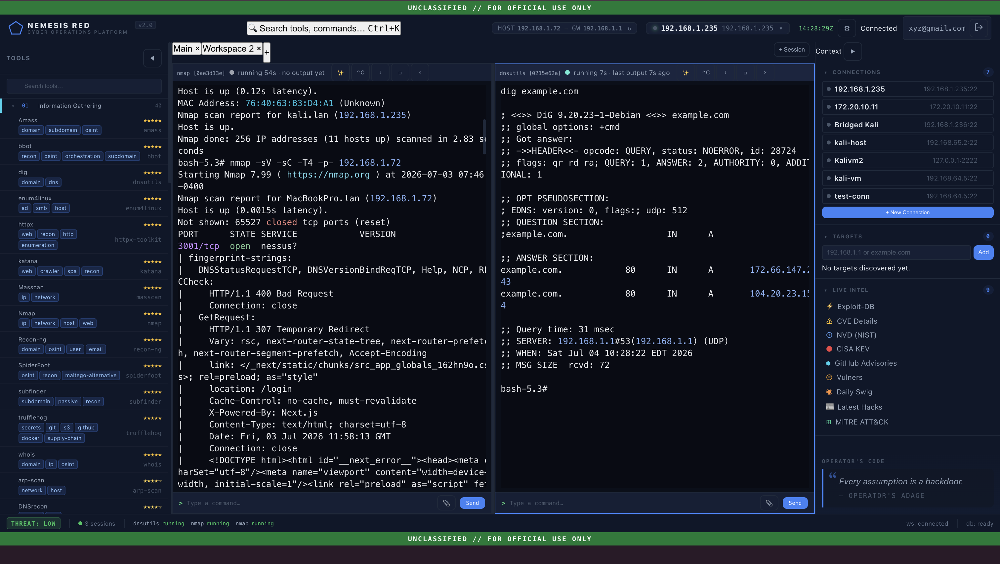
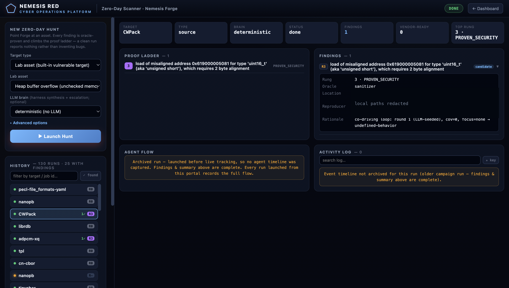
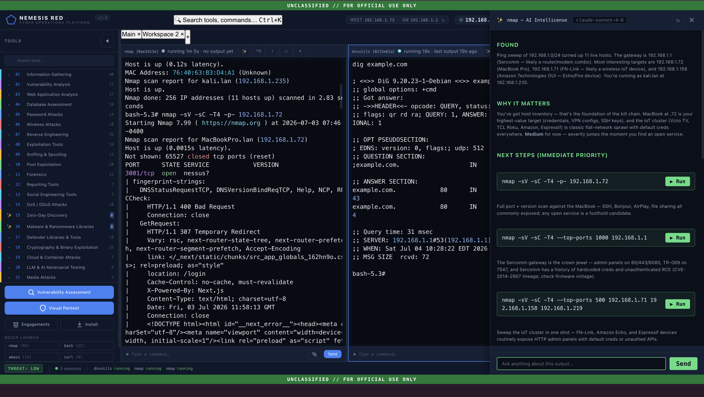
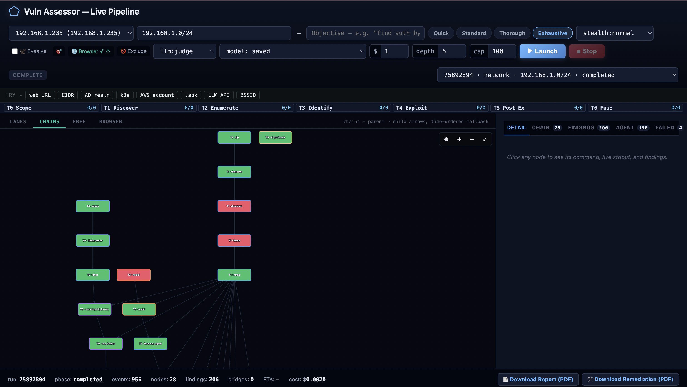
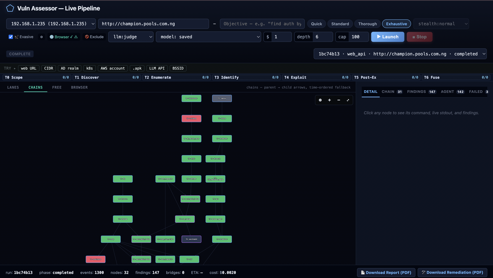
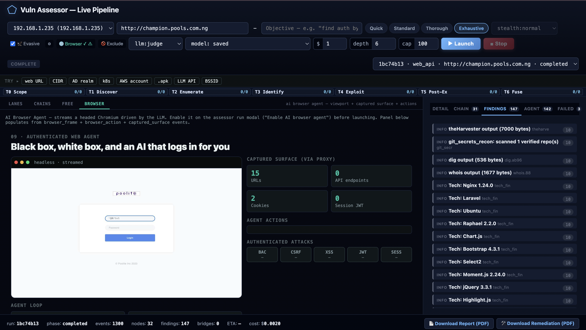
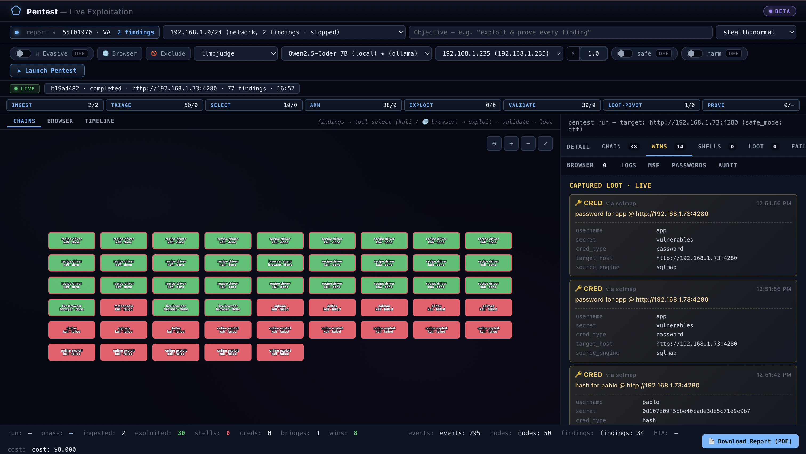

<div align="center">

# Nemesis Red

### Autonomous offensive security that proves its findings.

One container drives the full kill chain: recon, vulnerability assessment, live exploitation,
and novel zero-day discovery. It runs the standard Kali toolchain over SSH to a box **you**
control, reasons over the output with **your** LLM key, and reports nothing it cannot prove.
Your targets, traffic, and findings never leave your environment.


[Quickstart](#quickstart-2-minutes) · [Getting Started guide](GETTING_STARTED.md) · [Create an account](https://app.nemesislabs.xyz/register) · [nemesislabs.xyz](https://nemesislabs.xyz)

</div>



---

## Why this exists

Autonomous scanning got cheap. Trustworthy autonomous scanning did not. Most "AI pentest"
tools are a language model wrapped around a scanner. They are fast to demo and hard to trust,
because a model asserting a bug is not the same as a bug. Run one against a real environment
and you get a queue of plausible claims a human still has to verify by hand.

Nemesis Red is built on the opposite premise. The report is only as good as the proof behind
it, so proof is the gate. Every finding that reaches a report has cleared a deterministic
check, not a model's opinion. A clean run reports nothing.

**Most AI pentest tools generate findings. Nemesis Red proves them.**

---

## What it is

Nemesis Red is a cyber-operations platform for penetration testers and security researchers.
It runs as an orchestrator: the reasoning happens locally on your machine, the tools run on
your Kali box over SSH, and the control plane only handles licensing. You bring the Kali, you
bring the LLM key (or point it at a local Ollama), and Nemesis Red does the driving.

It does not reinvent the offensive toolchain. It commands it. The standard Kali arsenal
(nmap, nuclei, sqlmap, ffuf, and the rest) runs over SSH, alongside purpose-built engines for
API surface discovery, broken access control, an authenticated browser agent, LLM-application
testing, and zero-day discovery. The reasoning loop reads every result and decides the next
move. The value is the reasoning over the tools, not the size of the toolbox.

---

## What sets it apart

- **Verification, not assertion.** Web and network findings are scoreboard-verified against
  the live target. Memory-safety findings climb a proof ladder from crash, to
  attacker-controlled primitive, to a working proof of exploitation. Nothing ships on a
  model's say-so.
- **A reasoning loop, backed by published research.** The core is ReasonChain, a closed-loop
  architecture that plans, acts, reads the result, and replans on accumulated evidence.
  Cross-tool fusion is causally validated in a controlled ablation (Wilcoxon p < 0.001). The
  paper and the code that regenerates every number are public.
- **Zero-day discovery, not CVE lookup.** A dedicated engine hunts novel bugs in the
  open-source components a target runs, proves exploitability, and assembles a
  coordinated-disclosure packet. It has already found and reported a real one (below).
- **AI application security.** It tests LLM features against the OWASP LLM Top 10, including
  prompt injection, data exfiltration, and tool abuse, across API, chat, and browser.
- **Yours, end to end.** Self-hosted orchestrator, bring your own key, license-gated so the
  image cannot be cracked, and air-gap capable. Your data stays in your environment.

---

## Four ways to work, one platform

- **Copilot console.** A live multi-session terminal with an AI that reads every command's
  output, tells you why it matters, and hands you the next commands to run with one click.
- **Autonomous vulnerability assessment.** Point it at a web app or a network (a URL, host,
  or CIDR), pick a depth, and watch it plan and run a full assessment as a live reasoning
  graph. Cross-tool CVE fusion, hundreds of findings per run, and a signed report at the end.
  Run it once, or schedule it on a cron.
- **Autonomous pentest.** Take the findings from an assessment straight into live
  exploitation. It selects exploits, fires them, and captures real proof: credentials, hashes,
  database dumps, and shells.
- **Zero-day scanner.** Point the discovery engine at an asset or an open-source component.
  It runs coverage-guided fuzzing and patch-seeded variant hunting, proves each candidate on
  the proof ladder, and produces a reproducing trigger, a root cause, and a suggested fix.

---

## Zero-day on Windows desktop software (companion package)

The Red container runs on Linux, so it hunts source and Linux components. It cannot open a
Windows desktop application. For zero-day discovery against **installed Windows software** (image
viewers, PDF and office suites, media parsers), Nemesis Red ships a separate native Windows
package: **Nemesis Red Zero-Day for Windows**. Same proof engine, aimed at closed `.exe` files.

It opens each mutated input with the app under a first-chance exception handler, so it catches
faults the app's own error handling would otherwise swallow; verifies the crash un-instrumented;
and grades the faulting instruction into a primitive, from a proven fault, to an
attacker-controlled write-what-where, to a vendor-ready disclosure packet (reproducer, root cause,
suggested fix). A clean run reports nothing.

**Download:** [Nemesis Red Zero-Day for Windows](https://github.com/eobi/nemesis-red/releases/latest)
— portable ZIP, Windows 10/11 and Server (x64). It is self-contained (bundled Python and
instrumentation); there is nothing else to install. Extract and run:

```bat
nrzd.cmd --exe "C:\Program Files\Vendor\App.exe" --seeds seeds\sample.tga --suffix .tga --argv-template "{file}"
```

Run only against software you own, in a disposable VM snapshot. The target application is always
operator-supplied under its own licence; the package ships only the engine.

---

## Proof it works, not a demo

### A novel bug, found and disclosed

The zero-day engine found a previously-unreported heap out-of-bounds write in
[CWPack](https://github.com/clwi/CWPack), a widely-used MessagePack library for C. A
truncated MessagePack stream is treated as a successful read, the parser advances past the
end of its buffer, and the next refill calls `memmove` with a negative size (AddressSanitizer
reports `negative-size-param`). The engine minimized a 74-byte trigger, root-caused it to the
stream-refill handler, produced a short proof-of-vulnerability and a suggested patch, and
reported it upstream under coordinated disclosure. Found by fuzzing the public source only,
with no third-party systems touched.

This is novel-bug discovery with a reproducing trigger and a fix, not a match against a known
CVE list.

### Depth on a live target

A single autonomous run against an OWASP-class environment surfaced more than 300 CVE-backed
findings, including multiple CVSS 9.8 issues (for example CVE-2024-38476, an Apache
mod_rewrite SSRF), each reproducible from a clean checkout. That is roughly an order of
magnitude more validated findings than a single-pass scan, measured in a controlled ablation,
while precision on the labeled benchmark holds at 82 percent. The verifier gate is what keeps
the noise out.

---

## See it work

### Zero-day discovery, with a proof ladder

The zero-day scanner runs a hunt to completion and shows every step: the proof
ladder, the oracle that proved each finding, and the run history. This run against
CWPack reached rung 3 (PROVEN_SECURITY), proven by the sanitizer oracle, with the
crashing location and a saved reproducer. A clean run reports nothing.



### AI copilot that thinks alongside you

The copilot reads raw tool output and turns it into a plan: what was found, why it matters,
and the exact next commands to run. Bring your own frontier model (Claude, GPT) or run it
fully local on Ollama.



### Autonomous vulnerability assessment as a live graph

Launch an assessment and watch the reasoning graph build in real time: recon feeds
enumeration, enumeration feeds identification, and the loop fuses tool output into CVE-backed
findings. Export a full report and a remediation plan.



Works across target types, with evasive routing and a browser stage for web apps:



### An AI browser agent that logs in for you

Black-box or white-box, the browser agent drives a headed Chromium: it maps the app surface,
logs in, and runs authenticated attacks (broken access control, CSRF, XSS, JWT, session), all
captured through a proxy.



### Live exploitation with captured proof

It takes assessment findings into exploitation and captures the evidence: credentials, hashes,
dumps, and shells.



---

## Quickstart (2 minutes)

See [GETTING_STARTED.md](GETTING_STARTED.md) for the full walkthrough. In short:

1. Create an account at [app.nemesislabs.xyz/register](https://app.nemesislabs.xyz/register).
2. Have a Kali box reachable over SSH (a VM is fine), and an LLM key or a local Ollama.
3. Pull and run the container, sign in, point it at your Kali, and launch a scan.

Everything is gated server-side by a short-lived signed license, so the tool cannot be
cracked by editing the image, and every target stays inside your network.

---

## Built for security researchers

Findings come with a reproducing trigger, a root cause, and a suggested fix. The zero-day
engine assembles the coordinated-disclosure packet for you. The core architecture is public
and MIT-licensed ([ReasonChain](https://nemesislabs.xyz)), and every result in the research
paper regenerates from a clean checkout. You self-host it, you bring your own key, and your
work stays yours. When the engine finds nothing, it says so.

---

## Links

- Website: [nemesislabs.xyz](https://nemesislabs.xyz)
- Create an account: [app.nemesislabs.xyz/register](https://app.nemesislabs.xyz/register)
- Getting started: [GETTING_STARTED.md](GETTING_STARTED.md)

Nemesis Red is a product of Nemesis Labs. Commercial license. Bring your own Kali and your
own LLM key.
